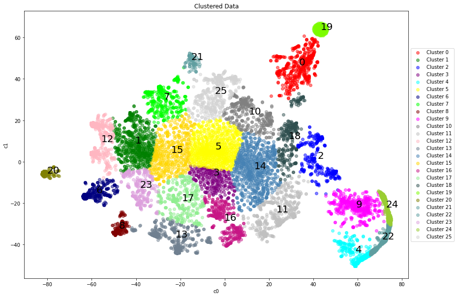

# t-SNE-Clustering

The dataset used on this project comes from [water_data](./CleanedUp_DataSet_Orbi.csv)

Clustering anomalies from water data based on t-SNE algorithm using t-SNE to group spesific cluster and performs dimensionality reduction, then use Gaussian Mixture to label each cluster.

Written in Python and uses the Scikit-Learn machine learning library.

This is unsupervised machine learning problem which purposed to see smaller clusters are identified as anomalies (Polluted water data).

The data is included on repo ("CleanedUp_DataSet_Orbi.csv"), with:
- Important Features start on first date column until the end of the column. Which "2021-11-29" column till "2022-09-02".
- "Ufid_1" and "Ufid_2" columns can be treated as index.

As written on the code, we use many class to label each cluster using Gaussian Mixture algorithm as shown below. 

    

Then, calculate many datapoint on each cluster, for the smaller one are identified as anomalies. We calculate similiarity to check if t-SNE + Gaussian Mixture will produce same result if we run more than one time.
